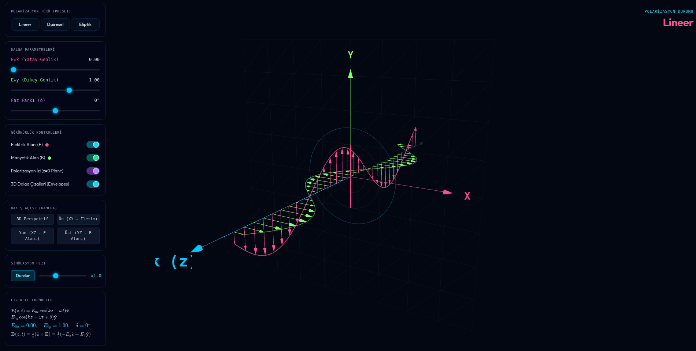

# ⚡ EM Wave Polarization Simulator

An interactive 3D electromagnetic wave polarization visualization tool built with Three.js, based on **David J. Griffiths — Introduction to Electrodynamics, §9.2.2**.

---

## 🌐 Live Demo

> Open [simulation.seoem.co](httos://simulation.seoem.co) in any modern browser — no build step required.

---

## ✨ Features

- **3D real-time visualization** of electromagnetic waves propagating along the z-axis
- **Three polarization presets**: Linear, Circular, Elliptical
- **Interactive parameter controls**:
  - E₀x — Horizontal amplitude
  - E₀y — Vertical amplitude
  - δ (delta) — Phase difference
- **Toggle visibility** of E-field vectors, B-field vectors, polarization trail, and 3D wave envelopes
- **Camera presets**: 3D perspective, XY (front), XZ (side), YZ (top)
- **Animation speed control** with play/pause
- **LaTeX equation rendering** via KaTeX
- **Mobile-friendly** touch controls (rotate + pinch-to-zoom)
- **Collapsible side panel** for clean fullscreen viewing

---

## 🧲 Physics

The electric field of a polarized EM wave is described by:

$$\mathbf{E}(z,t) = E_{0x}\cos(kz - \omega t)\,\hat{\mathbf{x}} + E_{0y}\cos(kz - \omega t + \delta)\,\hat{\mathbf{y}}$$

The magnetic field follows from Maxwell's equations:

$$\mathbf{B}(z,t) = \frac{1}{c}(\hat{\mathbf{z}} \times \mathbf{E}) = \frac{1}{c}\left(-E_y\hat{\mathbf{x}} + E_x\hat{\mathbf{y}}\right)$$

| Condition | Polarization Type |
|---|---|
| δ = 0° or ±180° | Linear |
| E₀x = E₀y, δ = ±90° | Circular |
| All other cases | Elliptical |

---

## 🛠️ Tech Stack

| Library | Purpose |
|---|---|
| [Three.js r128](https://threejs.org/) | 3D rendering |
| [KaTeX](https://katex.org/) | LaTeX math rendering |
| [Tailwind CSS](https://tailwindcss.com/) | UI styling |

---

## 🎮 Controls

| Action | Desktop | Mobile |
|---|---|---|
| Rotate | Click + Drag | Single finger drag |
| Zoom | Scroll wheel | Pinch gesture |

# emt-simulations
